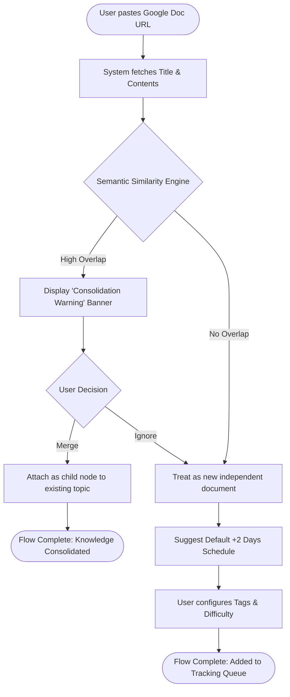
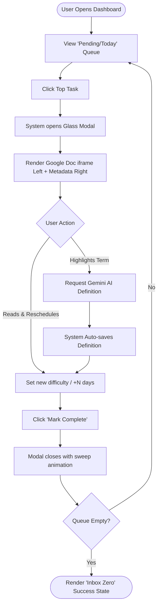

lastStep: 14
stepsCompleted: ['step-01-init.md', 'step-02-discovery.md', 'step-03-core-experience.md', 'step-04-emotional-response.md', 'step-05-inspiration.md', 'step-06-design-system.md', 'step-07-defining-experience.md', 'step-08-visual-foundation.md', 'step-09-design-directions.md', 'step-10-user-journeys.md', 'step-11-component-strategy.md', 'step-12-ux-patterns.md', 'step-13-responsive-accessibility.md', 'step-14-complete.md']
inputDocuments: [
  '/Users/gautam/Desktop/Projects/Revision-Master/_bmad-output/planning-artifacts/prd.md',
  '/Users/gautam/Desktop/Projects/Revision-Master/_bmad-output/planning-artifacts/product-brief-Revision-Master.md'
]
---

# UX Design Specification Revision-Master

**Author:** Gautam
**Date:** 2026-04-11

---

## Executive Summary

### Project Vision

Revision-Master acts as an active intelligence layer for unstructured Google Docs, providing a "Bring Your Own Storage" spaced-repetition workflow. It transforms linear brain-dumps into structured, interconnected knowledge graphs by automatically scheduling reviews, managing custom tags, and utilizing Gemini AI terminology generation, all to eliminate redundant learning loops.

### Target Users

- **Primary Persona:** Software engineers, continuous learners, researchers, and students.
- **Context:** Tech-savvy users who natively capture insights in Google Docs but suffer from "knowledge fragmentation" and loss of recall over time.

### Key Design Challenges

- **Information Density:** Balancing the display of embedded long-form Google Docs alongside a metadata-heavy dashboard (task tracking, notes, tags, difficulty scales) without overwhelming the user.
- **Merge & Consolidation Flow:** Designing an intuitive interface for identifying related concepts and resolving semantic "similarity warnings" without interrupting the primary workflow.
- **Frictionless Task Clearance:** Making the daily task clearing process (reviewing scheduled documents and marking them completed) feel instantaneous and cognitively light.

### Design Opportunities

- **Advanced Premium Light UI:** Employing a sophisticated, modern light theme that utilizes elegant typography, subtle depth, and clean layering (e.g., smart glassmorphism) to create a fascinating and professional workspace.
- **Rewarding Micro-interactions:** Integrating dynamic, fluid feedback when users clear tasks off their "Pending Revision" queue or define custom terminology, making the consolidation habit highly rewarding.
- **Structural Clarity:** Creating a distinct, visually distinct interface layer that cleanly separates the user's native Google Doc (iframe) from the platform's intelligence wrap.

## Core User Experience

### Defining Experience

The defining core action is the rapid, satisfying clearance of the daily "Pending Revision" queue, as well as the effortless ingestion of new Google Doc URLs. The system must feel like a lightweight, intelligent wrapper that enhances—rather than competes with—the user's underlying brain-dumping habit.

### Platform Strategy

- **Primary Interface:** A desktop-first web application, optimally designed for reading long-form technical content alongside the intelligence dashboard. 
- **Mobile Graceful Degradation:** A mobile-responsive layout expressly tuned for "task clearance on the go" (allowing users to quickly reschedule or mark docs as complete from their phone).
- **Control Modality:** Primarily mouse/keyboard on desktop for note-taking, with touch-friendly tap targets for rapid clearance on mobile devices.

### Effortless Interactions

- **One-Click Ingestion:** Pasting a Google Doc URL should automatically pull the title and suggest a default spaced repetition schedule (+2 days) instantly.
- **Queue Sweeping:** Marking a task as "Completed" should sweep the document out of sight with a satisfying, instantaneous micro-animation.
- **Smart Re-surfacing:** The system must do the heavy lifting of remembering *when* a document should return to the surface, demanding zero cognitive load from the user regarding scheduling math.

### Critical Success Moments

- **The Consolidation "Aha!":** The magical moment when a user pastes a new document and the system flags, "You already have a document strongly related to this topic," proving the app's value in preventing redundant learning.
- **The Empty Inbox:** The feeling of accomplishment when the user clears their daily tasks, trusting the system will hold their knowledge securely until the next optimal review interval.

### Experience Principles

- **Frictionless Ingestion:** Imposing minimal friction between having an idea in a Google Doc and tracking it in Revision-Master.
- **Rewarding Clearance:** Elevating the mundane task of revision into a visually satisfying, dopamine-releasing habit driven by the premium, light-themed aesthetic.
- **Clear Information Hierarchy:** Ensuring the embedded external content (Google Doc iframes) and our metadata (tags, notes, Gemini definitions) never fight for visual supremacy.

## Desired Emotional Response

### Primary Emotional Goals

Users should experience a profound sense of **Cognitive Relief** and **Empowerment**. Instead of feeling overwhelmed by a chaotic pile of unstructured text, they should feel completely in control, knowing their insights are securely tracked and mapped to an optimal review schedule. 

### Emotional Journey Mapping

- **During URL Ingestion:** A wave of relief ("This is saved; I don't have to carry the mental burden of remembering to review it").
- **During the Task Clearance Loop:** Satisfaction, focus, and a steady drip of productivity-driven dopamine as tasks are cleared from the queue.
- **When a Duplicate/Similarity is Detected:** Surprise, rapidly followed by delight ("Wow, the system just saved me from re-learning something I wrote 5 months ago!").
- **Returning Daily:** A calm, focused demeanor, looking forward to interacting with a visually pleasing, premium environment.

### Micro-Emotions

- **Accomplishment (not exhaustion):** Clearing the queue should feel like a victory, not a chore.
- **Confidence (not anxiety):** Trusting the system to bring knowledge back at the exact right time.
- **Delight (not boredom):** Experiencing a premium, fascinating light UI that elevates a historically mundane "admin" task into a modern, sophisticated habit.

### Design Implications

- **To foster Calm and Focus:** The light theme should utilize generous whitespace, extremely subtle borders, and soft shadows (like frosted glassmorphism) rather than harsh high-contrast lines. The UI must feel "weightless."
- **To foster Accomplishment:** Completed tasks should animate away smoothly with an elegant, fluid micro-interaction (e.g., a soft slide-and-fade, perhaps a subtle glow effect on completion).
- **To avoid Anxiety:** The "Pending Revisions" list should never look like a punishing tower of red overdue warnings. Instead, it should be presented as a clean, manageable stack of learning opportunities.

### Emotional Design Principles

1. **Design for Cognitive Offloading:** The interface itself should feel visually light and uncluttered, directly mirroring the feeling of offloading a mental burden.
2. **Celebrate Consolidation:** Reward the user visually when they merge disparate topics, turning what could feel like "admin work" into a moment of celebrated intelligence.
3. **Premium Aesthetics Build Trust:** A highly polished, "fascinating" UI isn't just decorative; it acts as a trust signal, assuring the user that their "second brain" is managed by a robust, state-of-the-art system.

## UX Pattern Analysis & Inspiration

### Inspiring Products Analysis

- **Craft:** An incredibly polished document and note-taking tool. 
  - *Successes:* Craft’s light theme is considered industry-leading. It uses soft shadows, subtle translucency, and beautiful typography to make reading long-form content a premium experience.
- **Linear:** A high-performance issue tracker. 
  - *Successes:* Although famous for its dark mode, its structured list views and keyboard-driven workflows make clearing a queue feel like a superpower. It eliminates unnecessary clicks.
- **Raycast:** A system launcher for macOS.
  - *Successes:* It represents perfect "Cognitive Offloading." You type a command, hit enter, and it vanishes. It feels weightless and instant.

### Transferable UX Patterns

**Navigation Patterns:**
- **Command-K / Omnibar (Raycast/Linear):** Implementing a universal search/command palette could allow power users to jump instantly to any document or tag without clicking through menus.
- **Floating Context Menus (Craft):** Keeping the UI uncluttered by hiding actions (like setting difficulty or scheduling) in elegant floating popovers that only appear upon interaction.

**Interaction Patterns:**
- **Keyboard-Driven Clearance:** Allowing users to press "E" (for example) to mark a task as completed immediately sweeps the row away.
- **Fluid List Reordering:** When a task is marked complete, the remaining tasks gracefully slide up into place with a subtle physics-based animation, rather than a jarring snap.

**Visual Patterns:**
- **Neumorphic/Glassmorphic Cards:** Using slight translucency and soft, multi-layered shadows on a light gray/white background to give the UI a "fascinating," tactile quality.
- **Micro-Animations for State Changes:** Subtle checkmark drawing animations or soft glowing borders when an AI definition resolves.

### Anti-Patterns to Avoid

- **The "Admin Panel" Look:** Avoid harsh, flat white backgrounds with strong 1px solid gray borders. That makes the UI feel like a generic B2B dashboard, not a premium learning environment.
- **Information Overload Defaults:** Don't show all document metadata (full notes, all tags, history) in the primary task list. This creates anxiety. Instead, use progressive disclosure.
- **Jarring Context Switches:** Opening a Google Doc link shouldn't rip the user out of the app. It must be embedded smoothly to maintain immersion.

### Design Inspiration Strategy

**What to Adopt:**
- **Fluid Layouts and Soft Depth (from Craft):** Because it supports the goal of creating a premium, fascinating light UI that builds trust.
- **Keyboard Shortcuts (from Linear):** Because it supports the effortless "queue sweeping" core experience.

**What to Adapt:**
- **Progressive Disclosure:** Simplify the metadata display on the dashboard list view—only show the title and the next review urgency, hiding the detailed notes until the document is actively expanded.

**What to Avoid:**
- **Aggressive Warning Colors:** When flagging duplicate topics, avoid using alarmist red banners. Adapt the warning into a helpful, celebratory suggestion (e.g., a calm blue or subtle purple "Insight match detected"). 

## Design System Foundation

### 1.1 Design System Choice

**Tailwind CSS paired with Radix UI Primitives (e.g., shadcn/ui)**

We will utilize a "Themeable/Custom" hybrid approach. Instead of a rigid, established component library (like Material Design or Ant Design) that natively looks like B2B enterprise software, we will build on unstyled, accessible primitives using utility classes.

### Rationale for Selection

- **Total Visual Control:** To achieve the "fascinating," Craft-inspired light UI with custom glassmorphism and soft depth, we need complete control over the CSS architecture without fighting an existing library's overridden styles.
- **Speed + Quality Balance:** As a solo developer, building every component from scratch is too slow. `shadcn/ui` provides the complex interactive logic (dropdowns, modals, popovers) with zero styling opinions, allowing us to drop them in and theme them instantly with Tailwind.
- **Performance & Modernity:** This combination aligns perfectly with modern Next.js/React development, producing highly optimized, lightweight bundles necessary for the fast "queue sweeping" interactions.

### Implementation Approach

1. **Primitive Setup:** Install `shadcn/ui` to handle all complex accessible components (Select menus, Dialogs, Tooltips, Command Palettes).
2. **Global Space:** Configure `tailwind.config.ts` to reflect a heavily customized color palette (soft whites, translucent grays, calm accent colors) rather than default Tailwind colors.
3. **Utility Layering:** Create core UI components (like the Document Card) using Tailwind utility classes optimized for subtle box-shadows, backdrop-blurs (glassmorphism), and typography scaling.

### Customization Strategy

- **Typography First:** Overhaul default fonts to a premium sans-serif (e.g., Inter, Geist, or SF Pro) to establish an immediate sense of quality.
- **Lighting and Depth:** Configure custom Tailwind shadow utilities (`shadow-soft`, `shadow-hover`) rather than relying on default harsh drop shadows.
- **Micro-Interactions Built-in:** Standardize transition utilities (`transition-all duration-300 ease-out`) across all interactable elements to ensure the UI feels fluid and responsive.

## Core Interaction & Experience Mechanics

### Defining Experience

The signature moment of Revision-Master is the **"Inbox Zero" Clearance Loop intertwined with Pre-emptive Similarity Warnings**. If an engineer dumps a link and instantly gets told, "Wait, you already wrote about Redis 5 months ago," they will instantly realize the product's value. The second defining action is clearing the daily scheduled review queue with a sense of fluid speed, knowing the mathematical repetition schedule is handled flawlessly behind the scenes.

### User Mental Model

- **Current Paradigms:** Users approach this with an "Email Inbox" or "To-Do List" mentality. They want the satisfaction of clearing items out.
- **The Shift:** However, a traditional "Inbox" breeds anxiety. We must shift their mental model to an **Opportunity Stack**. It's not "you are behind on 10 documents"; it is "here are the 3 optimal concepts to review today." 

### Success Criteria

- **Time-to-Clear:** A user should be able to review their notes, set a new difficulty/interval, and clear a document within 3 seconds of completing the reading.
- **Visual Validation:** The clearance must be confirmed *without* a full page reload—the row must vanish smoothly.
- **Merge Adoption:** When a duplicate warning fires, the user clicking "Merge" instead of "Ignore" is the ultimate success metric of the system's intelligence.

### Novel vs. Established UX Patterns

- **Established Pattern:** The "Task List" and "Swipe to Complete" (or click to complete) mechanics are universally understood.
- **Novel Pattern:** Embedding an external application (Google Docs `iframe`) alongside an active metadata layer (AI terminology & spaced-repetition schedules), creating a "split-screen" reading and tagging environment that requires zero context switching. 
- **The Twist:** Treating a saved URL not as a static bookmark, but as a living node that the system forcibly resurfaces on an algorithm's schedule.

### Experience Mechanics (The Clearance Flow)

1. **Initiation:** The user opens the app and sees "3 Revisions Scheduled for Today." They click the first item.
2. **Interaction:** The screen splits. The Google Doc renders on the left. The user's previous notes, tags, and AI term definitions appear on the right. They review the doc.
3. **Action:** They press a hotkey (e.g., `Spacebar` for next, `E` for mark complete) or click the soft glowing "Mark Complete" button. 
4. **Feedback & Completion:** A swift, satisfying micro-animation sweeps the document off the screen (e.g., sliding right and turning translucent), the progress bar fills up, and the next document immediately slides into view. When the queue hits zero, a beautiful, calm "All caught up" empty state appears.

## Visual Design Foundation

**Core Palette: Zen Productivity (Mint Tint)**
- **Canvas/Background:** A deeply calming, super-subtle sage/mint cream (`#f1f5f2`). Designed to drastically reduce eye strain during extended reading sessions.
- **Surface/Cards:** Pristine white (`#FFFFFF`) to clearly delineate workspaces, featuring standard, highly professional border rounding (`border-radius: 1.5rem`) without screaming for attention.
- **Typography:** Softened contrast. A deep, legible forest-slate (`#1e2d24`) for reading, paired with muted mossy grays (`#6b7f73`) for secondary metadata to prevent UI noise.

**Semantic State Colors (Strictly Applied)**
To ensure instant recognizability without requiring users to read text labels, all document states strictly follow this color-coding across the entire platform:
- **Active System Prompt (Today's Review):** Emerald Green (`#059669`) — High focus, immediate action required.
- **Upcoming (Scheduled):** Soft Blue (`#3b82f6`) — Calm, waiting securely in the queue.
- **Rescheduled / Stale:** Muted Amber (`#d97706`) — Attention slightly shifted or requires checking.
- **Completed / Mastered:** Slate Gray (`#64748b`) — Low emphasis, achieved, visually archived.

### Typography System

- **Primary Typeface (UI & Headings):** `Inter`. The absolute standard for high-legibility enterprise and productivity software. Extremely calm and unobtrusive.
- **Secondary Typeface (Document Titles/Reading Focus):** `Newsreader` (Serif). Used very sparingly to evoke a traditional "academic" or reading-focused mindset when interacting with document titles or core long-form content.
- **Secondary Typeface (Data/Tags/Code):** System monospace for dates and spaced-repetition metrics.
- **Type Scale:** Moderate, reading-focused scaling. We abandon massive marketing headers (`text-5xl`) in favor of tight, UI-focused spacing (`text-sm`, `text-base`, max `text-xl`) to maximize screen real estate for actual studying.

### Spacing & Layout Foundation

- **Base Unit:** Standard 4px grid.
- **Density:** Playful spacing. We will use generous internal padding for cards and push extreme border-radii (e.g. `rounded-[2rem]`) to create "bubbles" of content.
- **Shadows & Depth:** 
  - `shadow-md` paired with `border-4` card styles.
  - Interactive elements will feature a "Bouncy" hover state (`transition: transform 0.2s cubic-bezier(0.34, 1.56, 0.64, 1); hover:scale-105`) for immediate, satisfying tactile feedback.

### Accessibility Considerations

- **Contrast:** Ensure all slate-colored text against off-white backgrounds firmly passes WCAG 2.1 AA standards for readability.
- **Focus States:** Every interactable element (crucial for keyboard-driven quick-clearance) will have a distinct, elegant focus ring (e.g., `focus:ring-2 focus:ring-indigo-500/50`) so power users never lose track of where they are.

## Design Direction Decision

### Design Directions Explored

1. **The Focus Canvas:** A minimal, Notion-style split-screen layout prioritizing raw document exposure.
2. **The High-Density Tracker:** A Linear-style tabular dashboard focused on rapid, keyboard-driven queue sweeping.
3. **The Craft-Inspired Glass App:** A highly visual, soft-shadow heavy, modal-based clearance loop with floating context menus.

### Chosen Direction

**The "High-Density Tracker" (Dashboard) + "Glass Modal" (Clearance Loop) Hybrid**

### Design Rationale

To achieve an interface that is undeniably focused and restorative, we are adopting **Zen Productivity (Mint Tint)**.
- This style intentionally breaks away from "loud" marketing designs or massive geometric playgrounds. It uses calming white space, subtle emerald accents, serif typography flourishes, and clean app-like layouts.
- It transforms a heavy "knowledge management system" into a quiet, deeply organized personal library where cognitive load is driven strictly to zero.

### Implementation Approach

- **Dashboard View:** We use a full-height, app-like flex layout. The sidebar and search bar act as highly functional, muted navigational tools. The UI is designed to never distract. UI elements are sized for utility (`h-12`, `text-sm`), not for visual spectacle.
- **Reading / Clearance View:** The reading container is a calm white canvas. We utilize a split right-hand metadata pane for Markdown note-taking that sits quietly beside the main Google Doc. The design gets entirely out of the user's way.

## User Journey Flows

### 1. The Ingestion & Consolidation Flow
*How a user safely saves a new brain-dump into the system.*

### 2. The Daily Clearance Loop
*How a user interacts with scheduled revisions and clears their daily queue.*

### Journey Patterns
- **The "Smart Default" Pattern:** The system always assumes the cognitive load (e.g., auto-extracting titles, defaulting to +2 days) allowing the user to bypass manual entry unless they explicitly want to customize.
- **The "Escape Hatch" Pattern:** Users must always have the right to ignore similarity warnings. The AI assists but never forces a merge.

### Flow Optimization Principles
- **Asynchronous Checks:** The semantic similarity engine must run in the background. The user shouldn't freeze during paste while the AI thinks; they can proceed to configure tags, and the warning banner slides in if a match is found.
- **Zero-Refresh Clearance:** When executing the "Clearance Loop", the system must optimistic-update the UI instantly, removing the queue item rather than waiting for the database response to reload the page.

## Component Strategy

### Design System Components (shadcn/ui)
We will leverage shadcn/ui for accessible, unstyled primitives to ensure rapid development without fighting default CSS:
- **Button, Badge, Input, Select:** Core form controls for ingestion and tagging.
- **Dialog:** The engine behind our Glass Modal.
- **Toast:** For success micro-interactions (e.g., "Term Saved!").
- **HoverCard & Tooltip:** For displaying dense metadata without cluttering the screen.

### Custom Components

#### 1. The Split-Screen Glass Modal
**Purpose:** Provides the "Inbox Zero Clearance Loop" environment without forcing a hard page navigation.
**Anatomy:** 
- *Left Pane (70%):* Hosts the embedded Google Doc iframe.
- *Right Pane (30%):* Fixed metadata sidebar for notes, tags, difficulty slider, and the primary "Clear Task" action.
**States:** Loading (shimmer/skeleton for the iframe), Active, Completing (fade-and-slide-out animation).
**Accessibility:** Focus-trapped. Closes on 'Esc' natively using the shadcn `Dialog` primitive.

#### 2. The Task Row Card
**Purpose:** Represents a single document in the high-density Linear-style dashboard.
**Anatomy:** Interactive row containing an urgency indicator (color-coded), document title, truncated notes preview, and interactive tag badges.
**Interaction Behavior:** Hovering over the row reveals an "E" shortcut hint and slightly lifts the row via a subtle `shadow-sm`. Clicking anywhere opens the Glass Modal.

#### 3. AI Terminology Context Popover
**Purpose:** Appears when a user highlights text within the platform, offering a one-click "Define with Gemini" action.
**Anatomy:** Small, floating tool-tip style action menu.

### Component Implementation Strategy
- We will build all Custom Components out of the established Design System primitives. For example, the **Split-Screen Glass Modal** will simply be a fully-styled Next.js component wrapping a shadcn `DialogContent` primitive overlaid with our `backdrop-blur-xl` Tailwind utilities.

### Implementation Roadmap

**Phase 1 - Core Flow Components (MVP):**
1. Standard Inputs & Buttons (shadcn setup).
2. The Task Row Card (for the dashboard queue).
3. The Split-Screen Glass Modal (to enable the clearance loop).

**Phase 2 - Supporting & AI Components:**
1. AI Terminology Context Popover.
2. The Similarity Warning Banner (to handle the Consolidation flow).

## UX Consistency Patterns

### Button Hierarchy
- **Primary Actions (e.g., Mark Complete, Save URL):** High emphasis. Heavy border-radius (`rounded-full`), utilizing bright pink/indigo gradients, and utilizing the custom `bouncy-hover` transform to feel alive.
- **Secondary Actions (e.g., +2 Days, Add Tag):** Low noise but fun. `rounded-full` with a thick border (e.g., `border-2 border-indigo-100 bg-indigo-50`) that bounces on hover.
- **Destructive Actions (e.g., Delete Document):** Tucked into an ellipsis dropdown, using a soft `rose-500` to indicate danger clearly without ruining the playful vibe.

### Feedback Patterns
- **Micro-Interactions (The Sweep/Bounce):** Crucial for emotional reward. Marking a task complete triggers a bouncy animation that sweeps the item playfully off the screen. No hard page reloads.
- **Routine Feedback (Toasts):** For expected actions ("Term saved to Glossary"), a non-blocking toast notification sliding in from the bottom right confirms success and vanishes automatically.
- **Intervention Feedback (Banners):** For system alerts requiring active user decisions ("Wait, you saved this doc before"), a banner gracefully pushes down from the top of the interface, pausing the flow rather than blocking it entirely.

### Navigation & Keyboard Patterns
- **Power User Tooltips:** Every actionable button must display its corresponding keyboard shortcut in a Shadcn tooltip on hover (e.g., hovering "Mark Complete" shows `[E]`). 
- **Command Palette:** A global search triggered by `Cmd+K` / `Ctrl+K`. This pattern trains users to rely on the keyboard for cross-app navigation rather than hunting through sidebars.

### Empty State Patterns
- **The "Inbox Zero" State:** A crucial emotional touchpoint. When a user clears their list, we replace the empty void with a deliberate, calming success state (e.g., an elegant vector graphic of a stacked, checked-off list with a message like "All caught up for today.").

## Responsive Design & Accessibility

### Responsive Strategy
- **Desktop-First Execution:** The core value of Revision-Master (side-by-side Google Doc embedding and tagging) inherently demands a wide viewport. The primary design effort will focus on Desktop (`1024px+`) and Ultrawide monitors (with constrained `max-w-screen-2xl` containers to prevent extreme stretching).
- **Mobile Degradation:** On mobile (`< 768px`), the app degrades gracefully into a linear read-out. The "Split Screen" becomes a stacked view: Tap to open the Google Doc link externally, or swipe to mark complete based on title/notes alone. 

### Breakpoint Strategy
We will rely on Tailwind's default breakpoints to ensure consistency across the Next.js ecosystem:
- `sm: 640px` (Small Tablets / Large Phones)
- `md: 768px` (Tablets / Portray viewing - Sidebars collapse into hamburger menus)
- `lg: 1024px` (Desktop - Split-screen layouts activate)
- `xl: 1280px` (Large Desktop)

### Accessibility Strategy
We will target **WCAG 2.1 Level AA** compliance.
- **Color Contrast:** The "Layered Light" theme relies heavily on strict contrast testing. Text will rarely fall below the `slate-500` threshold on white backgrounds to guarantee `4.5:1` contrast ratios.
- **Keyboard Navigation Guarantee:** Because the app is built for speed, full keyboard operability is not just an accessibility feature; it's a core product feature. Every interactive component must capture focus correctly and provide visual `focus-visible:ring` feedback.

### Testing Strategy
- **Automated A11y:** Integration of `eslint-plugin-jsx-a11y` during development to catch missing ARIA labels and alt-texts instantly.
- **Responsive Testing:** Daily development checks using Chrome DevTools device mode, paired with native testing on iOS Safari to ensure Safari's bottom-bar doesn't intersect with fixed UI elements.

### Implementation Guidelines
- **Use `rem` exclusively:** For typography and margins, preventing interface breakage if the user boosts their browser's default font size.
- **shadcn/ui Built-in A11y:** Rely exclusively on Radix UI primitives for complex components (Modals/Dropdowns) as they ship with native ARIA roles and trap focus automatically out of the box.

---
*End of UX Design Specification Document*
